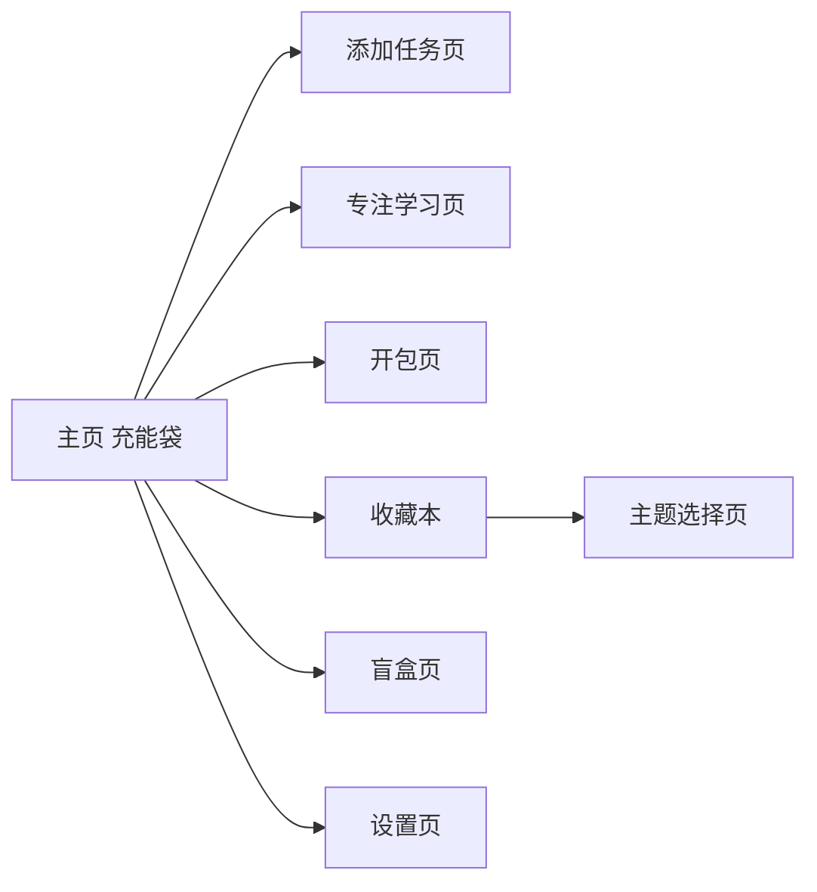
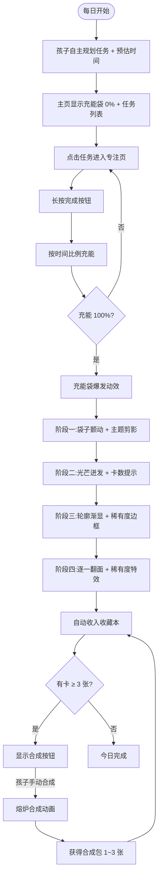

# 儿童学习陪伴小程序 · 核心需求文档

> 版本：V5.0  
> 文档日期：2026-05-21  
> 平台：微信小程序  
> 核心理念：一套一世界，一月一收藏

---

## 一、产品概述

一款帮助孩子建立作业自主规划习惯的微信小程序。孩子回家后自定今晚任务清单，通过**时间驱动充能袋**直观看到努力的累积，充能完成后**开包抽卡**获得精美收藏卡片。

孩子从四套主题中选择一套作为当前收集目标，每天完成作业即可抽卡。卡片分为 N/R/SR/SSR 四个稀有度等级，重复卡可手动合成新包。系统通过**新卡保底 + 重复合成**控制收集节奏，目标是在约 30 天内完成一套 50 张卡的主要收集体验。每 15 天可更换一次收集主题，已收集进度永久保留。

核心理念：**孩子不是因为害怕被催而做作业，而是因为"我今天还想再开一包卡"。**

---

## 二、四大核心模块

### 模块一：时间驱动充能袋

#### 2.1 功能描述

主页中央展示一个**布袋/能量袋**图标，随任务完成按时间比例充能。充能满 100% 时触发爆发动效，进入开包抽卡流程。**每日一袋，隔天重置。**

#### 2.2 充能规则

| 项目 | 说明 |
|---|---|
| 初始状态 | 每日空袋，显示 0% |
| 充能比例 | 单项任务完成 → 充能 = (该任务预估时间 ÷ 今日总预估时间) × 100% |
| 充能动效 | 平滑过渡动画，袋子逐渐发光、膨胀 |
| 100% 状态 | 袋子剧烈抖动 → 主题剪影一闪 → 金光爆开 → 进入开包页 |
| 重置规则 | 每日 0:00 重置，未完成的袋子不留存 |
| 每日上限 | 1 次开包机会 |

#### 2.3 充能颜色变化

| 进度 | 颜色 | 含义 |
|---|---|---|
| 0% - 29% | 浅灰蓝 | "刚起步，慢慢来" |
| 30% - 69% | 暖橙渐变 | "越来越近了" |
| 70% - 99% | 蜂蜜金 | "就差一点！" |
| 100% | 爆发彩虹渐变 + 粒子特效 | 触发开包 |

#### 2.4 操作流程

1. 孩子打开小程序，添加今晚的作业项（任务名 + 预估时间）
2. 主页显示空布袋 + "今日任务 X 项，共 Y 分钟"
3. 点击某一项进入专注页，倒计时开始
4. 长按完成按钮 → 返回主页 → 布袋充能比例增长
5. 全部任务完成 → 布袋 100% 爆发 → 自动跳转开包页

#### 2.5 专注页（极简）

- 只显示：当前任务名 + 倒计时数字 + 完成按钮
- 没有任何弹窗、广告、装饰
- 完成按钮长按 1 秒触发，避免误触
- 倒计时归零时轻柔提示音，不强制结束

---

### 模块二：语音提醒

#### 2.6 功能描述

通过语音（非文字弹窗）在三个关键时刻陪伴孩子。声音温柔不催促，孩子可以选择关闭。

#### 2.7 三个语音触发时机

| 时机 | 内容示例 |
|---|---|
| 任务开始时 | "{学科}开始啦，加油，我在这里。" |
| 任务完成时 | "完成一项，能量又涨了一截。" |
| 全部完成时 | "能量满了！快去开包吧。" |

#### 2.8 详细需求

| 项目 | 说明 |
|---|---|
| 语音性别 | 默认温柔女声，可切换 |
| 音色风格 | 自然、平等、不夸张 |
| 时长 | 每条语音 3-5 秒，简短不啰嗦 |
| 音量 | 默认中等，孩子可独立调节 |
| 关闭选项 | 设置中可一键关闭语音 |
| 实现方式 | 预录真人语音文件 / TTS 合成 |

#### 2.9 严格禁止的语音内容

- ❌ 学习途中插入语音（除时间提醒外）
- ❌ 评判性话语（"你怎么这么慢"）
- ❌ 绑架性话语（"不完成妈妈会失望"）
- ❌ 浮夸吹捧（"你真是天才"）

#### 2.10 推荐语音文案库

**任务开始时（任选一句）**
- "{学科}开始啦，加油。"
- "我在这里，慢慢做。"
- "新的一关开始了。"
- "深呼吸，开始吧。"

**任务完成时**
- "完成一项，能量又涨了一截。"
- "好棒，袋子又鼓了一点。"
- "继续保持节奏。"
- "又前进了一步。"

**全部完成时**
- "能量满了，快去开包吧。"
- "袋子装满了，卡片在等你。"
- "通关啦，抽卡时间到。"

---

### 模块三：抽卡收藏系统（核心主线）

> 整个产品的核心驱动力。孩子自主选择一套主题进行收集，系统通过保底机制控制约 30 天的主要收集周期。

#### 3.1 系统概述

孩子首次使用时从四套主题中选择一套激活。每天完成全部任务后，充能袋爆发，获得 1 包该主题的精美收藏卡片。稀有度四级分层，重复卡可手动合成新包。**每 15 天可更换一次收集主题**，已收集进度永久保留。

**设计灵感来源**：90 年代水浒英雄卡收集体验 + FIFA 开包仪式感 + 现代集换式卡牌稀有度体系。

#### 3.2 主题卡池

##### 3.2.1 首期上线主题（4 套）

| 套系名称 | 目标用户 | 核心概念 | 美术风格 |
|---|---|---|---|
| **恐龙纪元** | 男孩偏好 | 远古巨兽，写实科普感 | 国家地理纪录片质感，厚涂油画风，大地色系 |
| **深空机甲** | 男孩偏好 | 原创宇宙探索机甲，非战斗型 | 科幻概念艺术，硬朗金属质感，白灰基调 + 蓝橙能量光 |
| **星梦泡泡** | 女孩偏好 | 原创泡泡精灵——圆滚滚、软乎乎，头顶星星触角 | 柔和糖果色，软胶/毛绒质感，潮玩盲盒风格 |
| **花园蜜语** | 女孩偏好 | 原创花灵——住在花瓣里的小精灵，每种花对应一个角色 | 水彩童话风，透明翅膀，柔光氛围，浪漫细腻 |

##### 3.2.2 每套卡组结构（50 张/套）

| 稀有度 | 名称 | 每套数量 | 占比 | 单张概率 | 特殊工艺 |
|---|---|---|---|---|---|
| **SSR** | 传说 | 4 张 | 8% | 3% | 全息动态闪面 + 烫金边框 + 专属出场动效 + 卡背特殊工艺 |
| **SR** | 稀有 | 10 张 | 20% | 12% | 镭射闪光覆膜 + 银边压纹 |
| **R** | 精良 | 16 张 | 32% | 30% | 珠光覆膜 + 主题色细边框 |
| **N** | 普通 | 20 张 | 40% | 55% | 哑光标准卡面 + 白色细边 |

##### 3.2.3 卡片背面设计

| 卡片类型 | 背面设计 |
|---|---|
| N / R / SR | **套系统一卡背**（如恐龙套：化石纹理 + 套系名称 + "Tabbit 成长收藏"） |
| SSR | 在统一卡背基础上增加**特殊工艺**（如烫金纹路、隐藏荧光图案），翻到背面即可感知其特殊性 |

##### 3.2.4 收集周期与保底机制

单纯依赖随机抽取无法稳定保证 30 天集齐 50 张，因此系统采用“随机惊喜 + 进度保底”的混合机制。

| 项目 | 规则 |
|---|---|
| 每日基础包 | 每天最多 1 包，包内随机 1~5 张，平均约 2.8 张 |
| 新卡保底 | 当前主题未集齐时，每日基础包至少包含 1 张未拥有卡 |
| 后期保护 | 当当前主题收集进度 ≥ 45/50 时，每 2 次基础包至少出现 1 张未拥有卡 |
| 稀有度保护 | SSR 不直接承诺 30 天全出，但最后 5 张阶段允许保底命中缺失 SSR |
| 合成补充 | 重复卡可手动合成新包，作为额外进度来源 |
| 目标周期 | 连续完成约 30 天，可完成一套 50 张卡的主要收集体验 |

说明：稀有度概率用于决定卡片惊喜感，收集完成周期由保底机制兜底，避免孩子长期卡在最后几张。

##### 3.2.5 概率公示（设置页展示，合规要求）

```
传说 SSR：3.0%
稀有 SR ：12.0%
精良 R  ：30.0%
普通 N  ：55.0%
```

注：以上为单张基础稀有度概率。实际收集进度还会受到“每日新卡保底”和“后期保护”影响，设置页需同时公示保底规则。

#### 3.3 主题选择与切换

##### 3.3.1 首次选择

1. 孩子首次进入小程序，完成新手引导后进入"选择你的收集主题"页面
2. 展示 4 套主题的**精美封面 + 名称 + 一句话描述 + 示例卡预览**（每套展示 3-4 张）
3. 孩子点击选择一套，确认后激活该主题卡池
4. 主页充能袋下方显示当前激活主题的图标和名称
5. 未选择的其他 3 套隐藏，不参与每日开包

##### 3.3.2 主题切换

| 规则项 | 说明 |
|---|---|
| 冷却时间 | 自上次选择/切换起 **15 天后**开放切换权限 |
| 切换入口 | 收藏本页面顶部"更换收集册"按钮 |
| 切换规则 | 孩子自由选择任意一套（包括之前收集过的）作为新激活主题 |
| 已收集保留 | 所有已收集卡片**永久保留在收藏本中**，切换不影响已有进度 |
| 切换提示 | 切换时弹窗确认："更换后，每日开包将获得【新主题】的卡片。你之前收集的【旧主题】卡片都在收藏本里，不会消失。" |

##### 3.3.3 切换的设计意图

- 15 天冷却：确保孩子不会频繁跳跃，培养"专注收集"的习惯
- 保留进度：消除切换的心理负担——"换主题不会丢失之前的心血"
- 长期驱动：孩子可能先集齐一套，再换下一套，最终目标是 4 套全收集

#### 3.4 每日开包机制

##### 3.4.1 开包规则

| 规则项 | 说明 |
|---|---|
| 触发条件 | 当日全部任务完成，充能袋 100% |
| 卡池来源 | 孩子当前激活的**那套主题**（唯一卡池） |
| 包内卡数 | 随机 1~5 张 |
| 稀有度判定 | 每张卡独立按概率表判定 |
| 新卡保底 | 基础包至少包含 1 张当前主题未拥有卡，已集齐时取消保底 |

##### 3.4.2 包内卡数分布

| 卡数 | 概率 | 视觉反馈强度 |
|---|---|---|
| 1 张 | 25% | 基础：袋子裂开，单卡弹出 |
| 2-3 张 | 50% | 标准：袋子爆开，卡片扇形展开 |
| 4 张 | 18% | 高级：光柱冲天，卡片依次飞出 |
| 5 张 | 7% | 传说级：全屏特效 + 专属欢呼音效 |

5 张满包约每两周一次，维持稀缺惊喜感。

##### 3.4.3 卡片正面信息

每张卡正面包含：

- **卡面主图**（占卡面 85% 面积，AI 生成精美插画）
- **卡名**（底部居中，如"霸王龙"、"彩虹泡泡王"）
- **稀有度标识**（右上角图标：N / R / SR / SSR，不同颜色区分）
- **编号**（左下角："No.12 / 50"）

#### 3.5 逐步揭示开包仪式（核心体验）

> 孩子点击充能满袋进入开包页后，整个揭示过程分 4 个阶段渐进展开，总计约 6~8 秒，每步都需要孩子主动点击推进。

##### 3.5.1 阶段一：袋子颤动（0~2 秒）

- 屏幕中央显示充能满袋，剧烈抖动
- 袋子表面浮现**当前激活主题的剪影图标**（如恐龙轮廓），0.3 秒闪过
- 自动过渡到阶段二

##### 3.5.2 阶段二：光芒迸发（2~3.5 秒）

- 袋子爆开，屏幕被主题色光芒填满（恐龙套：琥珀金光；泡泡套：彩虹柔光）
- 隐约可见卡片轮廓在光芒中若隐若现，但看不清具体内容
- 显示包内卡数提示（如"×3"），让孩子知道这包有几张
- 孩子点击屏幕任意位置 → 进入阶段三

##### 3.5.3 阶段三：轮廓渐显（3.5~5.5 秒）

- 光芒退去，卡片的**灰色轮廓**从模糊到清晰逐一浮现
- 仍看不到卡面内容和稀有度
- 轮廓数量 = 包内卡数，排列成扇形
- **稀有度边框颜色**逐渐从轮廓边缘渗入：金色（SSR）、银色（SR）、主题色（R）、白色（N）
- 此时孩子已经知道稀有度分布，但还不知道具体是什么卡
- 孩子点击任意一张轮廓 → 进入阶段四

##### 3.5.4 阶段四：逐一翻面（5.5~8 秒）

- 被点击的轮廓翻面，卡面全貌展现
- 伴随对应稀有度的音效和光效：
  - SSR：全屏金色粒子 + 专属短音效（约 1.5 秒）
  - SR：银光扫过卡面 + 清脆叮声
  - R：温和光晕 + 轻快提示音
  - N：干净翻面，无特殊音效
- 语音播报（仅 SSR/SR）：如"传说卡片——霸王龙！"
- 孩子继续点击下一张轮廓，直到所有卡片翻完
- 全部翻完后显示"已加入收藏本"，自动跳转收藏本展示新卡位置

#### 3.6 合成系统

##### 3.6.1 合成规则

| 规则项 | 说明 |
|---|---|
| 触发条件 | 收藏本中某张卡拥有数量 ≥ 4 张 |
| 操作方式 | **孩子手动选择**是否合成（收藏本中出现"合成"按钮） |
| 消耗 | 消耗 3 张同款重复卡，系统至少保留 1 张在收藏本中 |
| 产出 | 1 包合成卡（同主题，1~3 张随机） |
| SSR 概率提升 | 合成包 SSR 概率从 3% 提升至 **5%** |
| 视觉动效 | 3 张卡飞入熔炉 → 火焰/魔法特效 → 新包生成（"熔炉合成"动画） |

##### 3.6.2 合成设计意图

- 让孩子觉得"重复不是浪费，是资源"
- 手动合成给予掌控感，孩子自己决定什么时候用
- 概率微幅提升使合成不只是"再来一次"，而是"这次可能更好"
- 天然驱动孩子继续收集 N 卡来合成，驱动每日坚持

#### 3.7 收藏本

##### 3.7.1 收藏本总览

- 展示所有已开启过的主题封面（即使已切换，收藏本中仍保留）
- 每套封面下方显示进度：已收集 X / 50
- **集齐一套后**，该套封面从灰色变成**彩色金边 + "已收藏"印记**
- 当前激活的主题封面有高亮标记

##### 3.7.2 套系详情页

采用**固定卡槽位图**布局，50 个格子按稀有度分区排列：

| 状态 | 展示形式 |
|---|---|
| 已获得 | 彩色卡面缩略图，可点击放大欣赏高清大图 |
| 未获得 | 灰色卡片轮廓剪影，**不透露任何卡面信息** |
| N/R 未获得卡槽 | 纯灰底 + 淡淡边框 |
| SR 未获得卡槽 | 灰底 + 银色微光呼吸效果 |
| SSR 未获得卡槽 | 灰底 + 金色微光闪烁 + "?" 标记 |

设计意图：SSR 的 4 个带金光的空槽，孩子每次翻收藏本都会看到——"到底还有哪张 SSR 我没拿到？"——这种好奇心本身就是明天继续做作业的动力。

##### 3.7.3 单卡放大页

- 点击已获得的卡片 → 全屏放大展示
- 支持缩放查看细节（呼应"制作精美"的要求）
- 显示卡名、稀有度、编号、获取日期
- 左滑右滑浏览同套其他已收集卡
- SSR 卡放大页显示特殊边框和光效

##### 3.7.4 集齐一套的奖励

某套全部 50 张收集完成时：

- 该套系封面在收藏本中变为**彩色金边 + "已收藏"金色印记**
- 解锁该套系的**专属主题壁纸**（主页背景可切换为该套系风格）
- 语音播报："{套系名}收藏完成，太了不起了。"
- 自动赠送 1 个传说盲盒（100% 传说奖励）

#### 3.8 卡片美术标准

##### 3.8.1 总体要求

> **这是整个产品体验的基石。卡片必须精美到孩子愿意反复翻看收藏本。**

- 画面精细度等同于市面高端集换式卡牌（如宝可梦卡牌）
- 风格统一但单张辨识度高
- 符合 6~12 岁儿童审美：不恐怖、不抽象、不暴力
- 所有形象必须**完全原创**，不侵犯第三方知识产权
- 所有卡面使用 AI 生成 + 人工筛选精修

##### 3.8.2 原创 IP 设计方法

采用"反推-迭代"法创建原创角色：

1. **提取感觉**：分析受欢迎 IP 的核心视觉要素（如蒙奇奇的绒毛质感、拉布布的精灵感），提取"感觉"而非复制"形象"
2. **定义家族基因**：为每套主题设定统一的视觉规则（头身比、标志特征、色彩体系、质感），确保系列感
3. **AI 批量生成**：使用统一的 Prompt 模板，仅替换角色特征词，批量生成候选图
4. **人工筛选精修**：从批量结果中挑选最佳角色，精修细节

##### 3.8.3 AI 生图 Prompt 模板（首期 4 套）

**恐龙纪元**：

```
[恐龙名称], collectible card illustration,
natural history museum documentary style,
dynamic pose, dramatic natural lighting,
rich earth tones, highly detailed skin texture,
8K quality, centered composition with clean margins,
professional paleoart, no text overlay, card art layout
--negative: cartoon, anime, text, watermark, blood, gore, skeleton
```

**深空机甲**：

```
[机甲名称], original sci-fi exploration mech design,
sleek rounded non-threatening form, glowing crystal energy core,
expressive sensor eyes, white and metallic color with blue or orange energy accents,
dramatic space lighting, 8K quality, sci-fi concept art,
centered composition with clean margins, no text overlay, card art layout
--negative: weapons, sharp edges, military, human pilot, text, watermark, dark horror
```

**星梦泡泡**：

```
[泡泡精灵名称], original cute bubble creature,
round cloud-like body, small star-shaped antenna on top, tiny stubby arms,
large sparkling dot eyes, innocent gentle smile,
soft candy colors (pink, lavender, mint, peach),
plush toy texture, 3D render, kawaii blind box style,
clean pastel background, card art layout
--negative: human, limbs, wings, text, logo, realistic, scary, dark
```

**花园蜜语**：

```
[花灵名称], original tiny flower fairy creature,
sitting inside a [花名] flower petal, translucent dewdrop wings,
petal dress, large curious gentle eyes,
soft watercolor storybook style, morning light glow,
gentle pastel colors, dreamy atmosphere,
clean soft background, card art layout
--negative: human face, realistic insect, text, logo, dark, scary
```

##### 3.8.4 卡片规格

| 项目 | 规格 |
|---|---|
| 卡面比例 | 3:4（竖向卡片） |
| 分辨率 | 不低于 1024×1365 px |
| 格式 | PNG（支持透明边框工艺叠加） |
| 工艺叠加 | SSR/SR 闪光/全息效果通过前端 CSS 动画实现，不需嵌入图片 |
| 生成工作流 | AI 批量生成 → 人工筛选（淘汰率约 60%） → 精修 → 套入卡片模板 |

---

### 模块四：盲盒系统（周常/成就奖励）

> 盲盒作为周常/成就奖励，与每日抽卡系统独立触发。

#### 4.1 触发条件

| 触发方式 | 说明 |
|---|---|
| 连续 3 天完成 | 系统自动发放 1 个普通盲盒 |
| 连续 7 天完成 | 系统自动发放 1 个高级盲盒（史诗概率提升，升至 20%） |
| 集齐一套卡片 | 自动赠送 1 个传说盲盒（100% 传说） |

盲盒不挤占每日开包，二者独立触发。

#### 4.2 盲盒内容结构

| 等级 | 概率 | 奖励内容 |
|---|---|---|
| 普通 | 60% | 虚拟徽章 / 装饰贴纸 |
| 稀有 | 25% | 主题卡片框 / 收藏本皮肤 |
| 史诗 | 12% | 现实小奖励券（家长配置） |
| 传说 | 3% | 现实大奖励券（家长配置） |

#### 4.3 现实奖励券（家长端录入）

**小奖励示例**：陪看 1 集动画、决定睡前故事、多吃一份甜点  
**大奖励示例**：周末公园之旅、买一本想要的书、一次家庭电影日

#### 4.4 开盒动画

宝箱抖动 → 光效迸发 → 奖励卡片飘落（约 2.5 秒），与抽卡系统的逐步揭示形成差异化体验。

---

## 三、其他必要功能

### 3.1 任务规划

- 主页有"添加任务"按钮
- 每个任务输入：任务名（≤20 字）+ 预估时间（5~90 分钟）
- 每晚最多 8 项
- 规划完成后主页显示"今日任务 X 项，共 Y 分钟"

### 3.2 家长端（极简）

- 录入现实盲盒奖励池内容（小奖励 + 大奖励）
- 查看孩子完成天数、连续完成天数（不查看具体任务内容）
- 查看孩子收藏本进度概览（各套系收集比例，不含具体卡片内容）

### 3.3 设置页

- 语音开关 + 音色切换
- 语音音量调节
- 抽卡概率公示（SSR 3% / SR 12% / R 30% / N 55%）
- 盲盒概率公示
- 主题壁纸切换（集齐一套后解锁对应壁纸）
- 关于我们 + 知识产权声明

---

## 四、边界规则与异常处理

### 4.1 任务与充能边界

| 场景 | 处理规则 |
|---|---|
| 当天没有任务 | 不允许开包，主页提示“先添加今天的任务” |
| 任务预估时间 | 单项限制 5~90 分钟，每日最多 8 项 |
| 完成后新增任务 | 若当日已开包，新增任务不影响今日开包状态；若未开包，按新的总预估时间重新计算充能 |
| 删除未完成任务 | 重新计算今日总预估时间与充能比例 |
| 删除已完成任务 | 不建议允许；如必须删除，需要二次确认，并重新计算充能 |
| 跨 0 点仍在专注 | 专注页可继续完成当前任务，但完成结果记入开始日期；回到主页后刷新到新的一天 |
| 倒计时归零 | 只提示，不自动完成；孩子仍需长按完成 |
| 小程序被关闭 | 重新打开后按服务器记录恢复任务状态，专注计时仅作前端显示辅助 |

### 4.2 开包与奖励边界

| 场景 | 处理规则 |
|---|---|
| 每日重复完成 | 每个自然日最多发放 1 个基础包 |
| 开包动画中退出 | 奖励在进入开包页前由服务端生成并锁定，重新进入后继续展示未完成开包结果 |
| 网络异常 | 任务完成可本地暂存；抽卡、合成、盲盒发放必须服务端确认后生效 |
| 已集齐主题继续开包 | 可继续获得该主题重复卡，用于合成或收藏计数；也可引导 15 天冷却后切换主题 |
| 合成误触 | 点击合成后需要二次确认；合成完成后不支持撤销 |
| 盲盒奖励券 | 现实奖励只由家长端配置，不由系统直接承诺实物或付费权益 |

### 4.3 儿童产品合规边界

- 不支持付费购买卡包、盲盒或抽卡次数。
- 不做排行榜、攀比式社交、公开炫耀战力。
- 不使用限时错过、连续登录惩罚、强刺激催促文案。
- 不在学习中途插入抽卡诱导。
- 家长端只看完成天数和收藏进度概览，不默认查看具体作业内容。
- 所有概率、奖励规则在设置页公开展示。

---

## 五、页面清单（共 8 个页面）



| 页面 | 核心元素 |
|---|---|
| 主页 | 充能袋 + 进度百分比 + 今日任务列表 + 添加按钮 + 当前激活主题图标 |
| 添加任务页 | 任务名输入 + 预估时间选择器 |
| 专注学习页 | 任务名 + 倒计时 + 长按完成按钮 |
| 开包页 | 四阶段逐步揭示动画 + 卡片展示 |
| 收藏本 | 各套系封面 + 卡槽位图 + 灰影空位 + 合成按钮 + 单卡放大 |
| 盲盒页 | 宝箱 + 开启动画 + 奖励展示 |
| 设置页 | 语音/音量/概率公示/壁纸/关于 |
| 主题选择页 | 4 套封面展示 + 选择确认（首次选择 & 15 天切换入口） |

---

## 六、核心用户流程（完整）



---

## 七、视觉风格

- **主色**：苔藓绿 #7BA68C（温暖、自然、不刺激）
- **辅色**：蜂蜜黄 #F5C26B（奖励感）
- **SSR 金**：#D4AF37（传说专属色）
- **SR 银**：#C0C0C0
- **背景**：米白 #FAF6F0（柔和护眼）
- **卡片区背景**：深灰蓝 #2C3E50（衬托卡面色彩）
- **风格**：圆润、温暖、大面积留白
- **字体**：圆体（阿里妈妈圆体，免费商用）

---

## 八、技术方案

| 模块 | 选型 | 说明 |
|---|---|---|
| 前端 | 微信小程序原生框架 | — |
| UI 库 | Vant Weapp | 基础组件 |
| 动画 | Lottie + CSS Animation | 开包四阶段动画 + 合成动画 |
| 后端 | 微信云开发 | — |
| 语音 | 预录 mp3 + innerAudioContext | — |
| 数据库 | 云数据库 | 用户数据、任务记录、收藏状态、合成记录 |
| 图片存储 | 云存储 | 所有卡面图片，按套系/编号组织 |
| 卡面生图 | Midjourney / DALL·E 3 | 按 Prompt 模板批量生成 + 人工筛选精修 |

---

## 九、数据库设计概要

### 9.1 用户数据

```
user_id
total_complete_days: 累计完成天数
consecutive_days: 连续完成天数
blindbox_count: 待开盲盒数量
active_series_id: 当前激活的套系 ID
last_switch_date: 上次切换主题的日期
voice_enabled: 是否开启语音
voice_type: 当前音色
volume: 语音音量
```

### 9.2 收藏记录

```
user_id
series_id: 套系 ID
card_id: 卡编号（1-50）
rarity: N / R / SR / SSR
count: 拥有数量
first_obtained_date: 首次获得日期
```

### 9.3 每日任务记录

```
user_id
date
tasks: [{name, estimated_minutes, completed}]
total_minutes
bag_charged: 是否已 100%
pack_opened: 是否已开包
pack_cards: [{card_id, rarity}]
```

### 9.4 套系与卡片配置

```
series
series_id
name
description
cover_image
status: active / preview / hidden
total_cards

cards
card_id
series_id
rarity
name
number
image_url
back_image_url
```

### 9.5 开包、合成与盲盒记录

```
pack_records
user_id
date
source: daily / synth
series_id
cards: [{card_id, rarity, is_new}]
opened: 是否已完成展示

synthesis_records
user_id
series_id
source_card_id
consumed_count
result_pack_id
created_at

blindbox_records
user_id
source: streak_3 / streak_7 / series_complete
level
reward_type
reward_content
opened
created_at
```

---

## 十、开发优先级

### 第一版（MVP，预计 2-3 个月）

1. 主页充能袋 + 时间驱动充能
2. 添加任务 + 专注页 + 长按完成
3. 三个时机的语音提醒（预录音频版本）
4. 1 套完整主题卡池（50 张）+ 其余 3 套主题封面预览
5. 主题选择页（首次选择；切换规则可先展示为“即将开放”）
6. 开包核心动画（四阶段流程可简化为 2-3 个关键阶段）
7. 收藏本基础功能（套系详情页 + 卡槽位图 + 灰影 + 放大查看）
8. 新卡保底 + 每日 1 包服务端发放
9. 合成系统（4 张起合成，消耗 3 张，保留 1 张）
10. 设置页（语音开关、概率公示、关于与合规说明）

### 第一版暂缓

- 4 套各 50 张完整精修卡
- 盲盒系统
- 家长端现实奖励配置
- 主题壁纸
- 完整四阶段高规格动画
- 更多语音音色

### 第二版（迭代）

- 补齐首期 4 套完整卡池
- 主题切换正式开放（15 天冷却）
- 盲盒系统（连续 3/7 天触发版）
- 家长端（盲盒奖励录入 + 完成天数查看）
- 集齐套系壁纸解锁
- 更多语音音色
- 更完整的开包四阶段动画
- 节日限定卡片（限时卡池）
- 收藏本数据统计

### 第三版（远期）

- 好友系统 + 卡片交换
- 限定活动卡池

---

## 十一、验收标准

### 11.1 任务与充能

- 用户可添加 1~8 个任务，每个任务预估时间限制为 5~90 分钟。
- 完成单个任务后，充能比例按“该任务预估时间 / 今日总预估时间”更新。
- 当日全部任务完成后，充能达到 100%，且当天最多只产生 1 个基础包。
- 倒计时归零不会自动完成任务，必须长按完成按钮确认。

### 11.2 开包与收藏

- 每日基础包由服务端生成，刷新或退出后不会重复发放。
- 未集齐当前主题时，每个基础包至少包含 1 张未拥有卡。
- 开包中断后重新进入，展示同一份已生成奖励。
- 新卡和重复卡都正确写入收藏记录，收藏本进度准确更新。

### 11.3 合成

- 只有某张卡拥有数量 ≥ 4 时才显示合成入口。
- 合成会消耗 3 张同款卡，并保留至少 1 张在收藏本中。
- 合成包与每日基础包分开记录，不影响每日开包上限。

### 11.4 设置与合规

- 用户可关闭语音，关闭后任务开始、完成、全部完成均不播放语音。
- 设置页展示抽卡概率、盲盒概率（如已上线）、无付费抽卡说明。
- 产品内不存在付费买包、排行榜、限时错过式抽卡诱导。

---

## 十二、产品四句话

1. **时间驱动充能袋**：每完成一项任务，袋子就鼓一点——努力是可见的
2. **自主选择加专注收集**：选一套心动的主题，约 30 天推进完成——目标清晰，动力持续
3. **逐步揭示仪式感**：不是瞬间开奖，而是一层层揭开——悬念与惊喜同在
4. **合成与切换**：重复不是浪费，是资源；15 天后可换新主题——永远有下一个目标

自己选，自己收集，自己完成。这就是全部。
